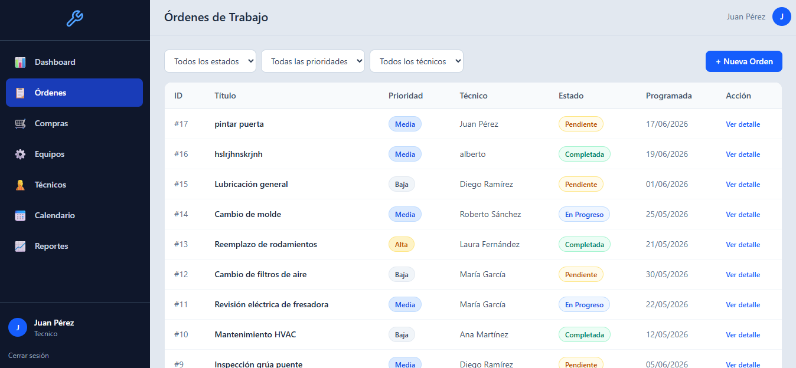
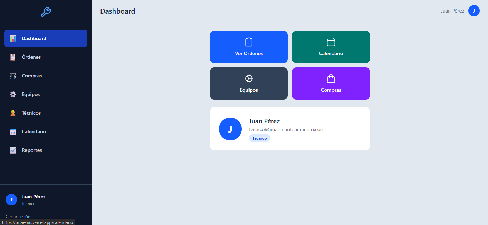
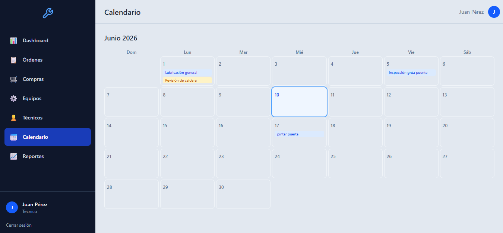
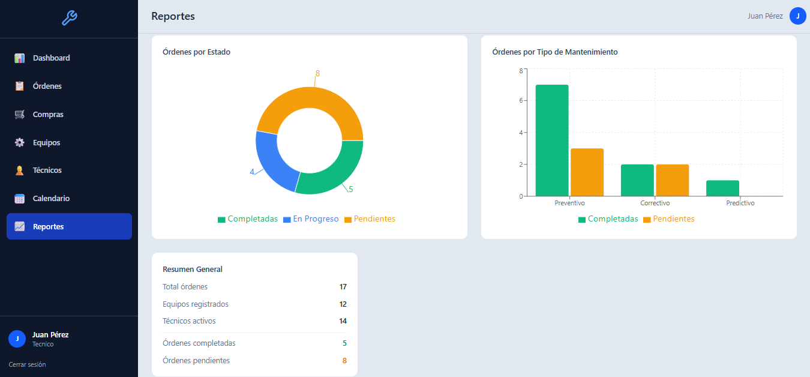

# Imae — Sistema de Control de Mantenimiento Industrial

Sistema fullstack para la gestión integral de mantenimiento fabril. Administración de órdenes de trabajo, compras, equipos y técnicos con autenticación, roles, dashboard de reportes y desarrollo completo con tests unitarios y E2E.

**Demo en vivo:** [imae-nu.vercel.app](https://imae-nu.vercel.app)

| Rol | Email | Contraseña |
|-----|-------|------------|
| Admin | `admin@ejemplo.com` | `CHANGE-ME` |
| Supervisor | `supervisor@ejemplo.com` | `CHANGE-ME` |
| Técnico | `tecnico@ejemplo.com` | `CHANGE-ME` |
| Operador | `operador@ejemplo.com` | `CHANGE-ME` |

---

## Funcionalidades

### Módulos principales
- **Dashboard** — Cards de acceso rápido a cada módulo, ficha de usuario con avatar y rol
- **Órdenes de Trabajo** — CRUD completo, filtros por estado/prioridad/técnico/búsqueda textual, detalle con PDF, fotos, historial de cambios, finalización
- **Compras** — CRUD completo, filtros por estado/búsqueda, detalle con PDF e historial de cambios
- **Equipos** — Grid con cards, detalle con historial de órdenes asociadas
- **Técnicos** — Lista con avatares, especialidad, teléfono, badge activo/inactivo
- **Calendario** — Vista mensual navegable (mes anterior/siguiente, botón "Hoy") con órdenes programadas
- **Reportes** — Gráficos de torta y barras (Recharts), filtro por fechas, exportación CSV
- **Perfil** — Foto con upload a Cloudinary, cambio de contraseña

### Capturas

<details>
<summary><b>Ver las 4 pantallas</b></summary>

**Órdenes de trabajo** — filtros por estado, prioridad, técnico y búsqueda



**Compras** — tabla con estado y búsqueda



**Equipos** — grid de cards con estado y próximo mantenimiento



**Técnicos** — cards con avatar, especialidad y estado activo



</details>

### Características transversales
- **Autenticación** — Login/registro via Supabase Auth con 4 roles (admin, supervisor, técnico, operador) y RLS policies en todas las tablas
- **Modo oscuro** — Toggle persistente en localStorage con detección de preferencia del sistema
- **Fotos** — Upload multiarchivo a Cloudinary, galería con lightbox
- **Historial de cambios** — Timeline por orden/compra con usuario, campo, valor anterior/nuevo
- **Compras vinculadas** — Una compra puede apuntar a la orden de trabajo que la originó; se ve en el listado y es navegable desde el detalle, para rastrear el repuesto hasta su equipo
- **Notificaciones en tiempo real** — Toast al crear/actualizar/eliminar órdenes via Supabase Realtime
- **Responsive** — Sidebar hamburguesa en mobile, tablas con scroll horizontal, grid adaptativo
- **Skeletons** — Estados de carga en todas las páginas (SkeletonTable, SkeletonCard, SkeletonSpinner)
- **Confirmación modal** — Diálogo promise-based reemplazando `confirm()` nativo

---

## Stack Tecnológico

| Capa | Tecnología |
|------|-----------|
| Frontend | React 19, Vite, Tailwind CSS v4, React Router v7 |
| Estado/API | TanStack Query |
| Backend/Datos | Supabase (Auth, PostgreSQL, Storage, RLS, Realtime) |
| Gráficos | Recharts |
| PDF | jsPDF + jspdf-autotable |
| Imágenes | Cloudinary (upload unsigned) |
| Iconos | react-icons (Heroicons) |
| Tests unitarios | Vitest + Testing Library (120 tests, 23 files) |
| Tests E2E | Playwright (18 tests, 10 specs) |
| Lint | ESLint 10 (flat config) |
| Deploy | Vercel (auto-deploy desde GitHub) |

---

## Tests

```bash
# Tests unitarios y de componentes
npm run test:run

# Con cobertura (HTML en ./coverage)
npm run test:coverage

# Lint
npm run lint

# Tests E2E (Playwright)
npm run test:e2e
```

**120 tests unitarios | 18 tests E2E | 100% pasando**

---

## Setup Local

```bash
git clone https://github.com/sant-maldonado/Imae.git
cd Imae
npm install
npm run dev
```

> La app se conecta a una instancia de Supabase ya configurada. Para usar tu propia instancia, creá un archivo `.env` con `VITE_SUPABASE_URL`, `VITE_SUPABASE_ANON_KEY`, `VITE_CLOUDINARY_CLOUD_NAME` y `VITE_CLOUDINARY_UPLOAD_PRESET`.
>
> **Instancia nueva:** ejecutá `supabase/schema.sql` completo en el SQL Editor. Es idempotente: podés re-ejecutarlo sin duplicar tablas, policies ni seeds.
>
> **Instancia existente:** si ya tenés el schema instalado, corré solo `supabase/patch_logs_compra.sql`, que agrega la tabla `logs_compra` (historial de cambios de compras) y habilita la publicación `supabase_realtime` para `public.ordenes` — sin esto último los toasts en vivo no funcionan.

### Scripts SQL de `supabase/`

| Archivo | Cuándo usarlo |
| --- | --- |
| `schema.sql` | Instancia nueva. Idempotente: podés re-ejecutarlo sin duplicar tablas, policies ni seeds. |
| `patch_logs_compra.sql` | Instancia que ya tiene el schema. Agrega `logs_compra` + RLS + realtime. |

---

## Portfolio

Proyecto fullstack profesional que demuestra:

- **Arquitectura sin backend propio** — Todo el negocio via RLS directo desde el frontend
- **Testing real** — Suite completa con tests unitarios, de componentes y E2E, más cobertura v8
- **UX completa** — Modo oscuro, responsive, skeletons, toasts, confirmaciones modales
- **Integración cloud** — Supabase (Auth + DB + Realtime + Storage) + Cloudinary
- **CI/CD** — Deploy automático en Vercel desde GitHub
